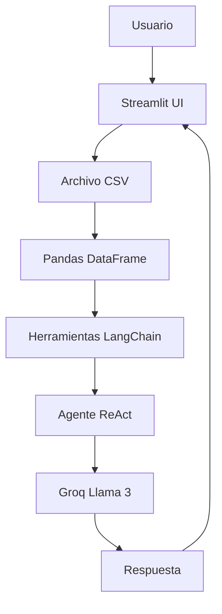
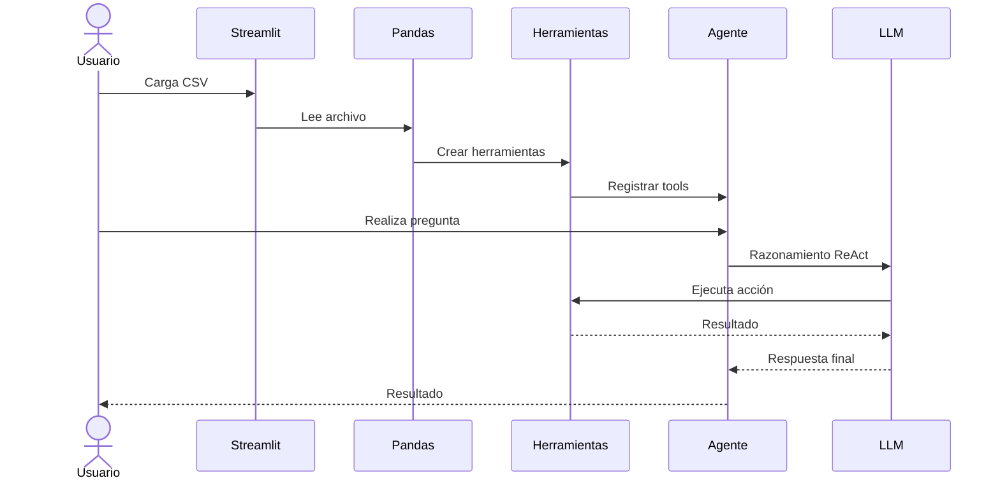

# 🦜 Asistente de Análisis de Datos con IA


Un asistente inteligente para explorar, analizar y visualizar datos utilizando **LangChain Agents**, **Groq LLMs** y **Streamlit**.

La aplicación permite cargar archivos CSV y realizar análisis avanzados mediante lenguaje natural, sin necesidad de escribir código.

---

# 📖 Descripción

Este proyecto implementa un agente de IA capaz de:

- Analizar datasets automáticamente.
- Generar reportes descriptivos.
- Responder preguntas sobre los datos.
- Crear visualizaciones dinámicamente.
- Utilizar herramientas especializadas mediante el patrón ReAct de LangChain.

Todo desde una interfaz web simple desarrollada con Streamlit.

---

# ✨ Características

## 📄 Reporte General

Genera automáticamente:

- Dimensiones del dataset
- Tipos de datos
- Valores nulos
- Registros duplicados
- Recomendaciones de limpieza
- Sugerencias de análisis

---

## 📊 Estadísticas Descriptivas

Calcula:

- Media
- Mediana
- Moda
- Desviación estándar
- Valores mínimos
- Valores máximos
- Posibles outliers

---

## 🔎 Preguntas en Lenguaje Natural

Ejemplos:

```text
¿Cuál es el promedio de ventas?

¿Cuál es la categoría más frecuente?

¿Cuántos registros existen por ciudad?
```

---

## 📈 Generación Automática de Gráficos

Ejemplos:

```text
Genera un gráfico de ventas por región

Crea un gráfico de barras con los clientes más frecuentes

Muéstrame la distribución de edades
```

---

# 🏗️ Arquitectura



---

# ⚙️ Flujo del Agente



---

# 🧠 Patrón ReAct Utilizado

El agente sigue el ciclo:

```text
Thought
Action
Observation
Thought
Action
Observation
Final Answer
```

Ejemplo:

```text
Question:
¿Cuál es el promedio de ventas?

Thought:
Necesito calcular la media de la columna ventas.

Action:
python_repl

Observation:
Promedio = 1540.35

Final Answer:
El promedio de ventas es 1540.35.
```

---

# 📂 Estructura del Proyecto

```text
.
├── app.py
├── herramientas.py
├── requirements.txt
├── .env
└── README.md
```

---

# 📦 Dependencias

```txt
langchain==0.3.22
langchain-groq==0.3.2
langchain-core==0.3.50
langchain-community==0.3.20
langchain-experimental==0.3.4

streamlit==1.44.1

pandas==2.2.3

matplotlib==3.10.1
seaborn==0.13.2

python-dotenv==1.0.1
```

---

# 🔑 Variables de Entorno

Crear un archivo:

```env
GROQ_API_KEY=tu_api_key
```

---

# 🚀 Instalación

## Clonar repositorio

```bash
git clone https://github.com/Orliluq/langchain-automatizando-con-agentes.git

cd langchain-automatizando-con-agentes
```

---

## Crear entorno virtual

### Windows

```bash
python -m venv .venv

.venv\Scripts\activate
```

### Linux/Mac

```bash
python -m venv .venv

source .venv/bin/activate
```

---

## Instalar dependencias

```bash
pip install -r requirements.txt
```

---

# ▶️ Ejecutar la aplicación

```bash
streamlit run app.py
```

---

# 🖥️ Interfaz

## Carga de CSV

- Selección de archivo
- Vista previa automática

## Reportes

- Información general
- Estadísticas descriptivas

## Consultas

- Preguntas libres sobre los datos

## Visualizaciones

- Creación automática de gráficos

---

# 🔍 Caso de Uso

Supongamos un dataset de ventas.

El usuario puede preguntar:

```text
¿Cuál es el producto más vendido?
```

El agente:

1. Analiza el DataFrame.
2. Selecciona la herramienta adecuada.
3. Ejecuta cálculos.
4. Devuelve la respuesta.

Todo sin escribir código.

---

# 🎯 Tecnologías Utilizadas

| Tecnología | Función |
|------------|----------|
| Streamlit | Interfaz Web |
| Pandas | Manipulación de datos |
| LangChain | Framework de agentes |
| Groq | Inferencia LLM |
| Llama 3 70B | Modelo de lenguaje |
| Matplotlib | Visualización |
| Seaborn | Gráficos estadísticos |

---

# 📈 Roadmap

- [ ] Soporte para Excel
- [ ] Soporte para Parquet
- [ ] Exportación PDF
- [ ] Dashboards automáticos
- [ ] Multiagentes
- [ ] Memoria conversacional
- [ ] RAG para datasets grandes

---

# 👩‍💻 Autor

**Orli Dun**

💬 Code with heart — Create with soul

- LinkedIn: https://www.linkedin.com/in/orlibetdungonzalez
- App: https://orlidun.vercel.app

---

# ⭐ Si este proyecto te resultó útil

Considera dejar una estrella en el repositorio.

```bash
⭐ Star the repo
🍴 Fork it
🚀 Build something amazing
```